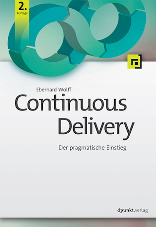

 

### Continuous Delivery

Continuous Delivery ermöglicht es, Software schneller und mit
wesentlich höherer Zuverlässigkeit in Produktion zu bringen als
bisher. Grundlage dafür ist eine Continuous-Delivery-Pipeline, die das
Ausrollen der Software weitgehend automatisiert und so einen
reproduzierbaren, risikoarmen Prozess für die Bereitstellung neuer
Releases darstellt.

### Das Buch

Dieses Buch erläutert, wie eine solche Pipeline praktisch aufgebaut
werden kann und welche Technologien dazu eingesetzt werden können.
Dabei geht es nicht nur um das Kompilieren und die Installation der
Software, sondern auch um verschiedene Tests, die dazu dienen, die
Qualität der Software abzusichern.

Mittlerweile ist das Buch in der zweiten Auflage erhältlich.

### Leseproben

Hier gibt es einige Leseproben als PDF:

* [Inhaltsverzeichnis](1_Inhaltsverzeichnis.pdf)
* [Einleitung](2_Einleitung.pdf)
* [Continuous Delivery: Was und wie?](3_ContinuousDelivery-Wasundwie.pdf)

### Was Leser sagen

Die erste Auflage des Buchs hat bei Amazon neun Rezensionen, alle mit
fünf Sternen. So hat sich das Buch als deutschsprachiges Standardwerk
etabliert.

### Autor

Eberhard Wolff arbeitet seit mehr als fünfzehn Jahren als Architekt
und Berater - oft an der Schnittstelle zwischen Business und
Technologie. Er ist Fellow bei innoQ und Java Champion. Als Autor hat
er über hundert Artikel und Bücher geschrieben und als Sprecher auf
internationalen Konferenzen vorgetragen. Sein technologischer
Schwerpunkt liegt auf modernen Architekturansätzen - Cloud, Continuous
Delivery, DevOps, Microservices oder NoSQL spielen oft eine Rolle.

Kapitel 4 hat Bastian Spanneberg beigetragen. Er ist IT-Berater und
Entwickler bei der codecentric AG, wo er Kunden im Bereich Continuous
Delivery unterstützt. Auf Twitter findet man ihn unter @spanneberg.

### Beispiele

Das Buch enthält ein Beispiel-Projekt. Es ist auf GitHub zu finden
unter [https://github.com/ewolff/user-registration-V2](https://github.com/ewolff/user-registration-V2) .

Die Beispiele für die erste Auflage finden sich unter
[https://github.com/ewolff/user-registration](https://github.com/ewolff/user-registration)
.

